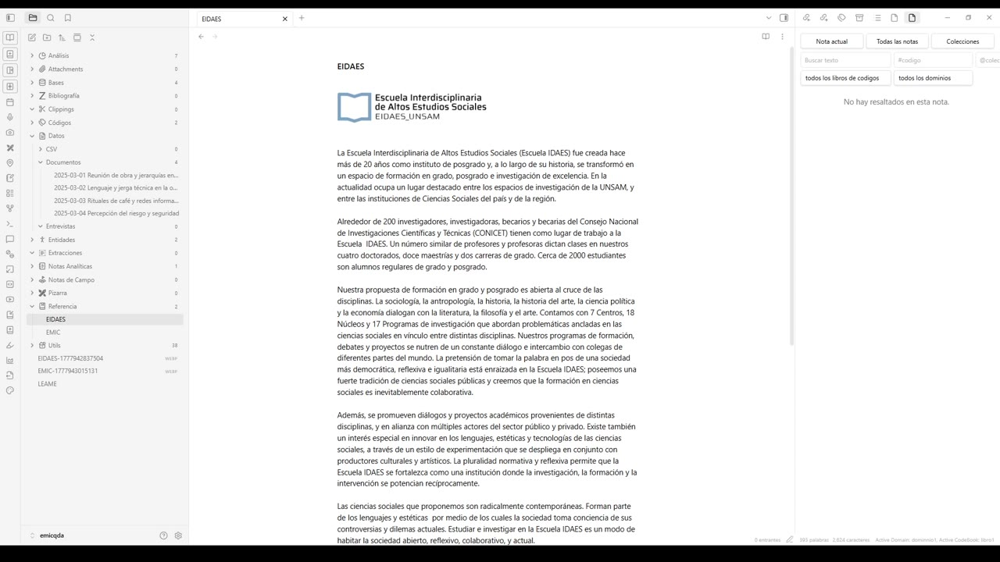
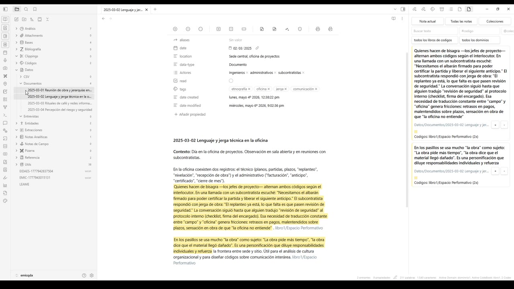
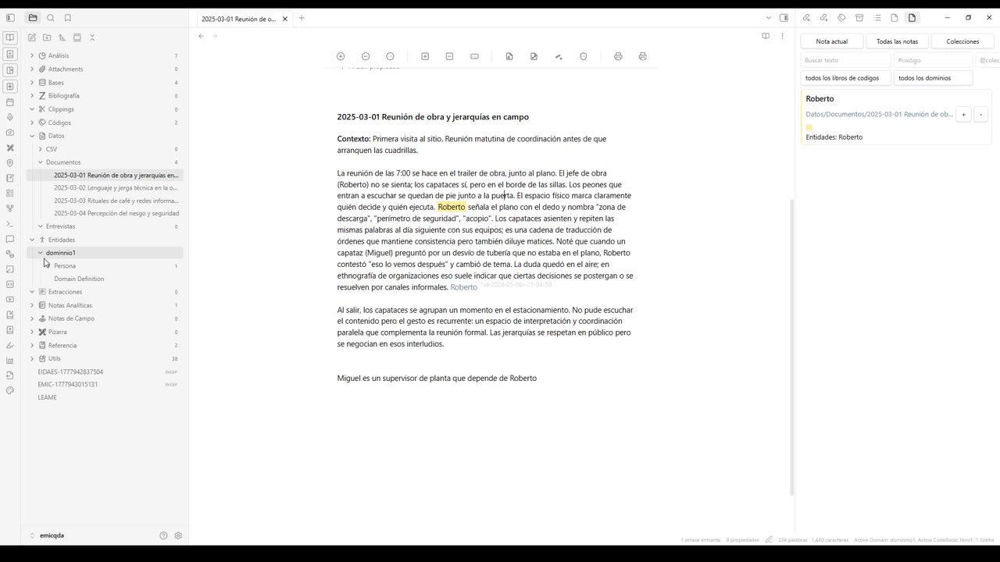
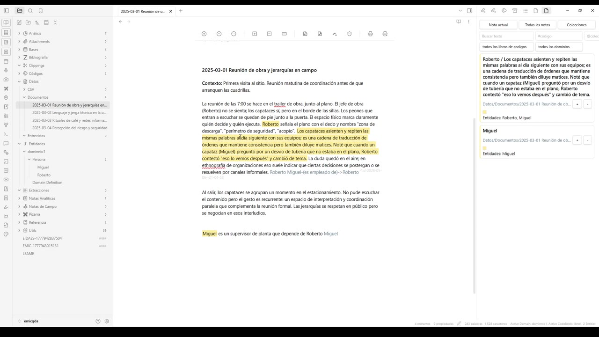
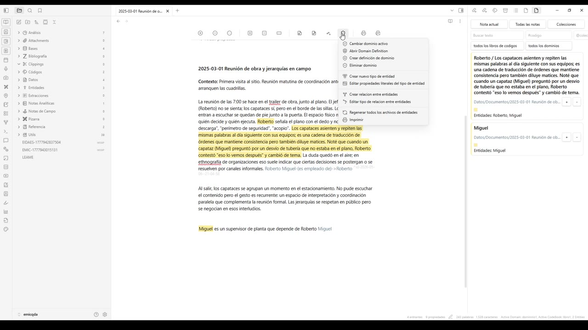
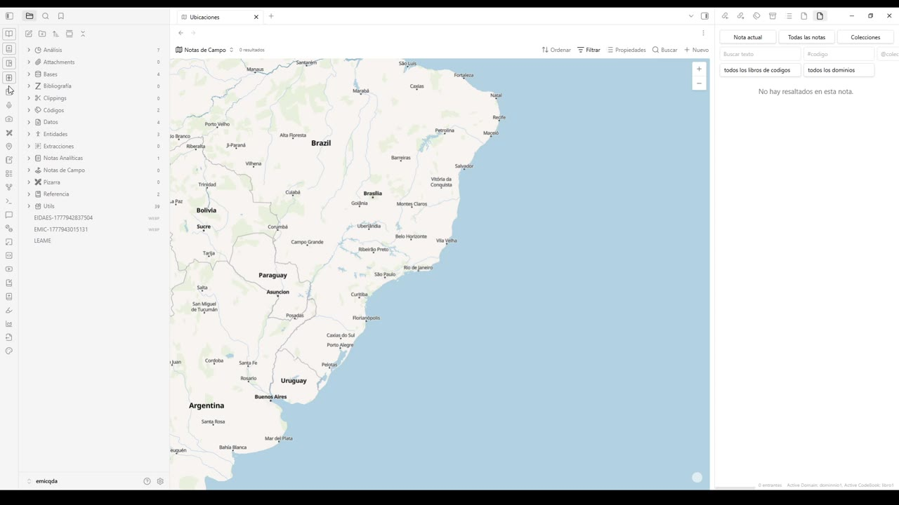
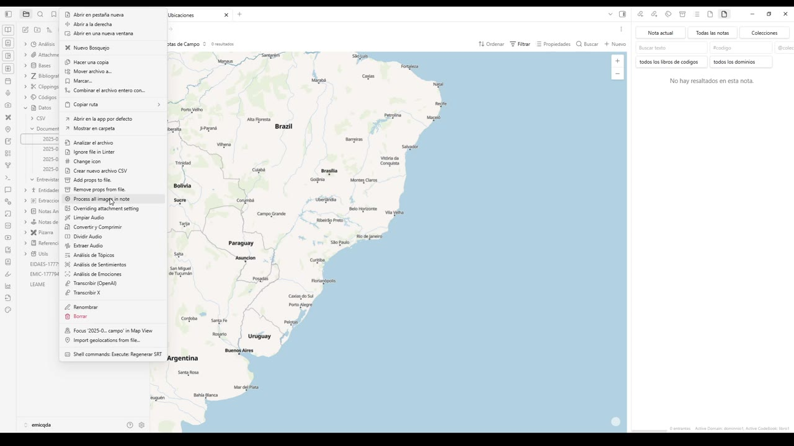
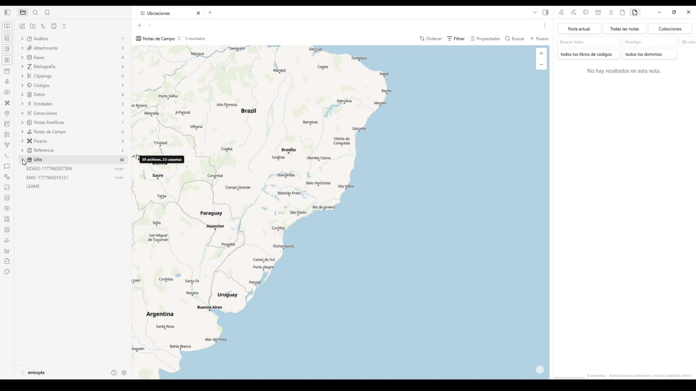

# 00 — Resumen

> Capítulo introductorio. Recorre, en pocos minutos, las capacidades centrales de **EMIC Plus QDA** para que el lector tenga una primera idea del alcance del entorno antes de entrar en cada función en detalle.

## Contexto

EMIC Plus QDA es una suite de análisis cualitativo construida sobre una bóveda (*vault*) de archivos Markdown. Cada pieza del trabajo de investigación —documentos primarios, notas de campo, entrevistas, códigos, entidades, ubicaciones, anexos multimedia, referencias bibliográficas— se gestiona como un archivo dentro del mismo proyecto, lo que permite trabajar con los datos en texto plano y, al mismo tiempo, aprovechar visualizaciones, asistentes y exportaciones especializadas.

El video de resumen muestra ese alcance "de vuelta entera": parte de la vista general del entorno y va deteniéndose en cada gran zona de la herramienta.

## 1. Vista general del entorno

Al abrir el proyecto, la pantalla se divide en tres columnas:

- **Barra lateral izquierda**: el árbol de carpetas del proyecto (Análisis, Attachments, Bases, Bibliografía, Clippings, Códigos, Datos, Documentos, Entrevistas, Entidades, Extracciones, Notas Analíticas, Notas de Campo, Pizarra, Referencia, Utils, etc.).
- **Panel central**: el contenido del archivo activo (un documento, una entidad, un código, un mapa, una pizarra, una nota analítica…).
- **Panel derecho**: paneles auxiliares dependientes del archivo en curso (notas relacionadas, búsqueda por libro de códigos y dominios, asistente de IA, editor de plantillas de estilo, etc.).

En la barra inferior se muestran los indicadores del estado de la sesión: *Active Domain* (dominio activo), *Active CodeBook* (libro de códigos activo) y métricas del archivo abierto (cantidad de palabras, caracteres, propiedades, entradas).

Esta primera vista corresponde a una nota de **Referencia** abierta como portada institucional. Sirve para mostrar la disposición de los tres paneles y la barra lateral con todas las secciones del proyecto.

## 2. Documentos codificados

Una de las ideas centrales de EMIC Plus QDA es que los **documentos primarios** —notas de campo, entrevistas, transcripciones, registros administrativos— viven en `Datos/Documentos`. Cada documento conserva sus propiedades (fecha, ubicación, tipo, actores, etiquetas) y, sobre el cuerpo del texto, se aplican **códigos** que se resaltan visualmente.

En esta nota de campo del 2 de marzo de 2025, dos fragmentos aparecen resaltados en amarillo: ambos corresponden al código *Espacio Performativo*. En el panel derecho se ven los pasajes asociados a la nota actual, agrupados por código, listos para ser revisados, comparados o exportados.

## 3. Entidades, personas y dominios

Más allá de los códigos, el entorno permite trabajar con **entidades**: actores, lugares, organizaciones u otros objetos del mundo real que aparecen en los datos. Las entidades se agrupan en *dominios* y, dentro de cada dominio, en *tipos* (por ejemplo, *Persona*).

En la imagen, el árbol de la izquierda muestra el dominio `dominio1` con el tipo *Persona* y dos entidades creadas: **Roberto** y **Miguel**. La nota central es la nota de campo donde estos actores fueron mencionados por primera vez; en el documento se ven sus apariciones marcadas y, debajo del cuerpo del texto, una línea de tipo *"Miguel es un supervisor de planta que depende de Roberto"*, que actúa como definición narrativa de la relación entre las dos personas.

## 4. Relaciones entre entidades

Las entidades no solo existen aisladas: pueden vincularse entre sí mediante **relaciones tipadas** (por ejemplo, *es empleado de*). El editor reconoce esa sintaxis y la propaga al panel derecho como evidencia.

En este fotograma, el sistema ya ha registrado el vínculo *Miguel — es empleado de → Roberto*. El panel derecho muestra dos tarjetas con los pasajes que sirven como evidencia de cada entidad y, al pie de la barra inferior, el contador indica `2 Entities` para confirmar que el dominio activo contiene esas dos personas.

## 5. Menú de gestión de dominios y tipos de entidad

Sobre el cuerpo del documento hay una barra de íconos. Uno de ellos abre el menú dedicado a la gestión de **dominios** y **tipos de entidad**.

Las opciones disponibles son:

- *Cambiar dominio activo* y *Abrir Domain Definition* para alternar o editar el dominio en uso.
- *Crear definición de dominio* y *Eliminar dominio* para crear o quitar dominios completos.
- *Crear nuevo tipo de entidad* y *Editar propiedades literales del tipo de entidad* para definir qué atributos describen a cada tipo (por ejemplo, edad, rol, organización para *Persona*).
- *Crear relación entre entidades* y *Editar tipo de relación entre entidades* para registrar nuevos tipos de vínculos (como *es empleado de*).
- *Regenerar todos los archivos de entidades* para reconstruir las fichas a partir de las evidencias registradas en los documentos.
- *Imprimir* para enviar el contenido a una salida impresa.

## 6. Vista de ubicaciones (mapa)

Cuando los documentos llevan una propiedad de geolocalización, el entorno los muestra sobre un mapa. La pestaña *Ubicaciones* abre una vista cartográfica que actúa como índice geográfico de las notas.

Esta capa permite filtrar por libro de códigos y dominio (los selectores se ven en el panel derecho) y enfocarse rápidamente en los puntos donde transcurrió el trabajo de campo.

## 7. Procesamiento de archivos: audio, imágenes y geolocalización

Al hacer clic con el botón derecho sobre un archivo de la barra lateral —especialmente sobre archivos multimedia o adjuntos— aparece un menú contextual extenso que reúne todas las herramientas de procesamiento de la suite.

Entre las opciones se incluyen:

- Operaciones de archivo estándar (abrir en pestaña nueva, copiar ruta, mover, renombrar, borrar).
- *Process all images in note* para correr procesamiento masivo sobre las imágenes embebidas.
- Manipulación de audio: *Limpiar Audio*, *Convertir y Comprimir*, *Dividir Audio*, *Extraer Audio*.
- Análisis de texto y voz: *Análisis de Tópicos*, *Análisis de Sentimientos*, *Análisis de Emociones*, *Transcribir (OpenAI)*, *Transcribir X*.
- Operaciones específicas del proyecto: *Crear nuevo archivo CSV*, *Focus en Map View*, *Import geolocations from file…*, *Shell commands: Execute: Regenerar SRT*.

Esta es la "caja de herramientas" desde la que se invocan, contextualmente, todas las rutinas de procesamiento que necesita un análisis cualitativo asistido.

## 8. Asistente de IA y notas relevantes

Cerrando el resumen, el panel derecho ofrece un asistente conversacional asociado al contenido del proyecto.

El asistente se construye sobre un índice del *vault*: una vez completada la indexación (la barra muestra `Indexing Complete 19/19 files 100%`), se pueden lanzar *prompts* sugeridos como:

- *Vault Q&A — What insights can I gather about <topic> from my notes?*
- *Vault Q&A — Based on my notes on <topic>, what is the question that I should be asking, but am not?*
- *Note Link Chat — Summarize the recent updates from [[<note>]].*

El sistema funciona como una capa de recuperación (*retrieval-based QA*): conviene incluir, en las preguntas, las palabras y conceptos que efectivamente existen en el *vault*.

## Síntesis

En unos pocos minutos, el video introduce una idea simple pero poderosa: EMIC Plus QDA reúne, sobre el mismo proyecto Markdown, los documentos primarios, el sistema de codificación, la red de entidades y dominios, las ubicaciones, los archivos multimedia con sus rutinas de procesamiento y un asistente conversacional. Cada uno de estos bloques se desarrolla, en detalle, en los capítulos siguientes del manual.
