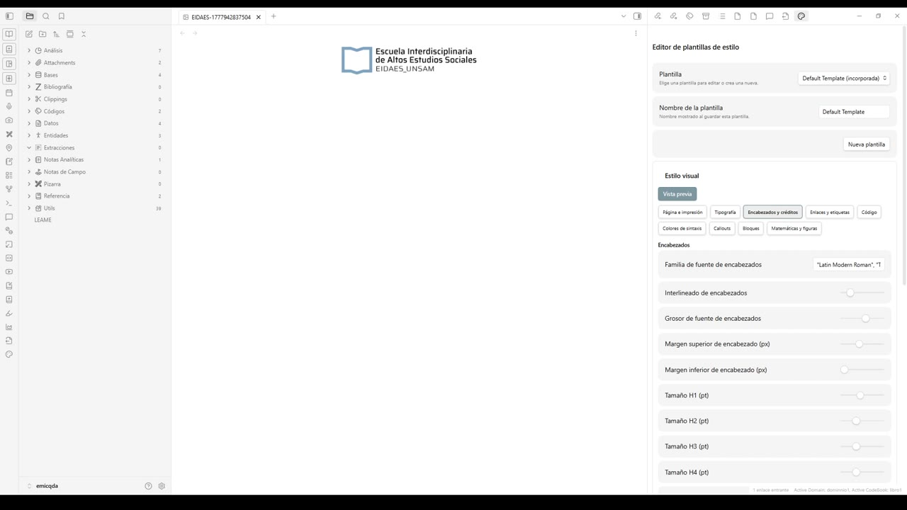
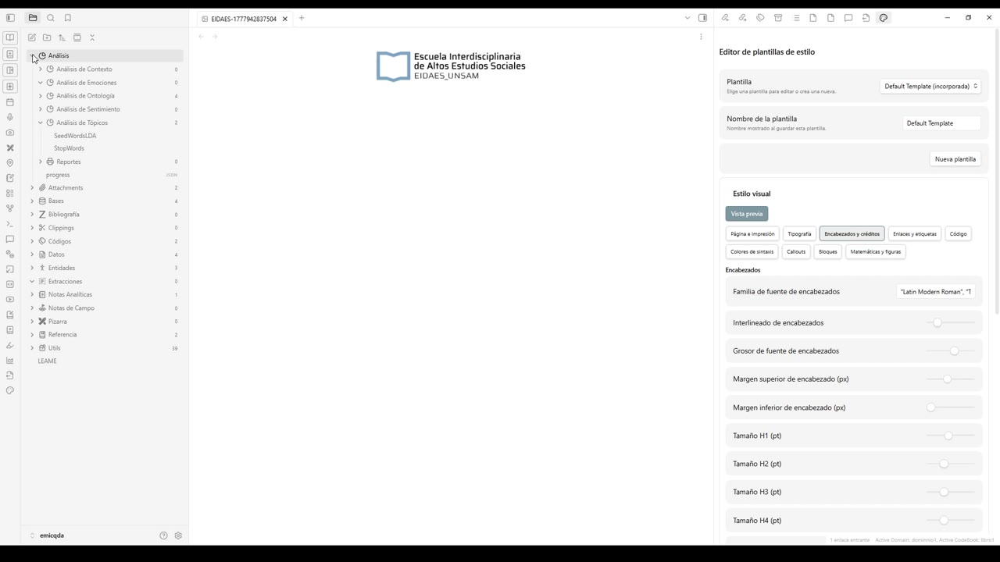
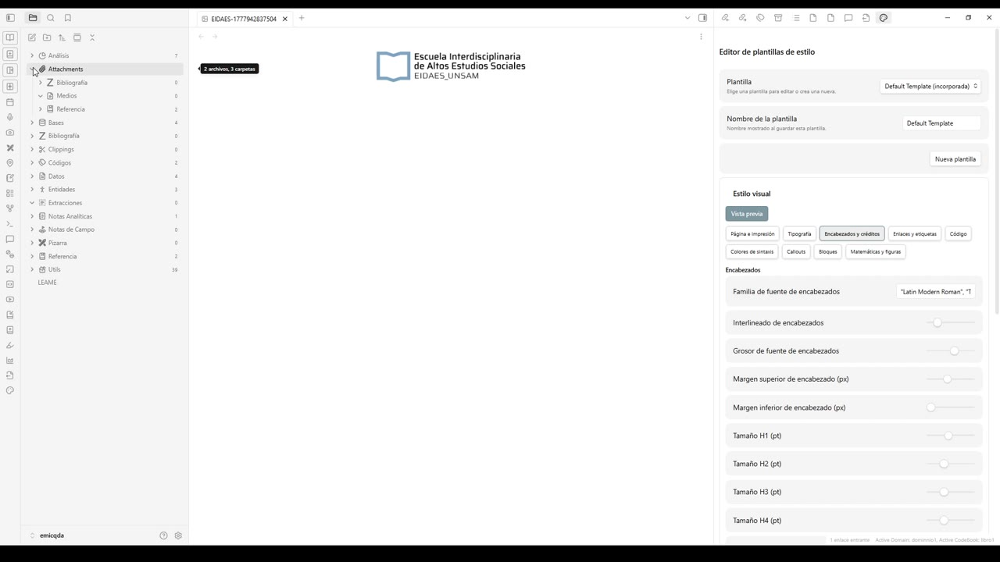
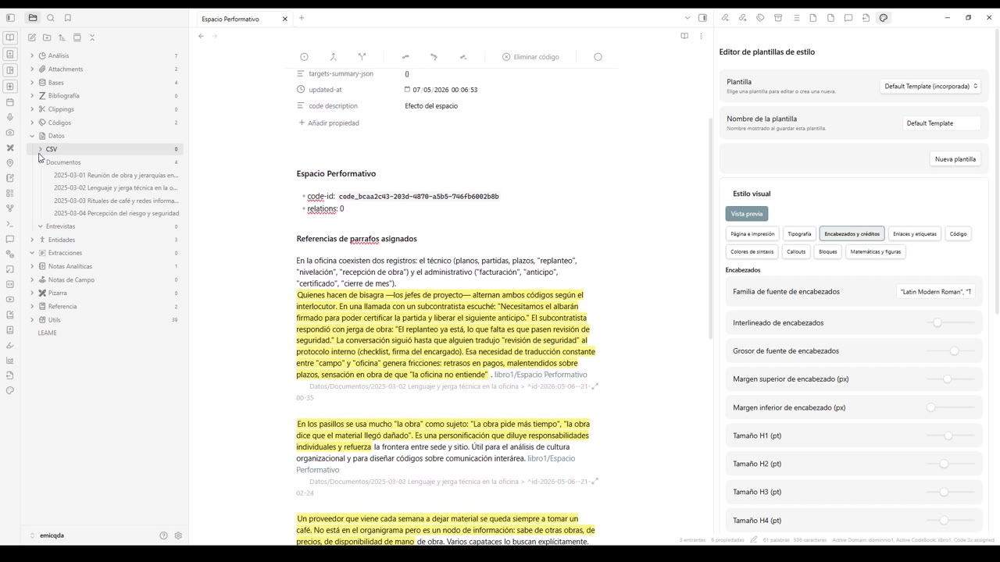
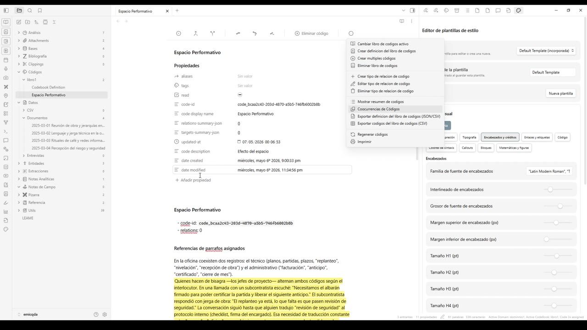
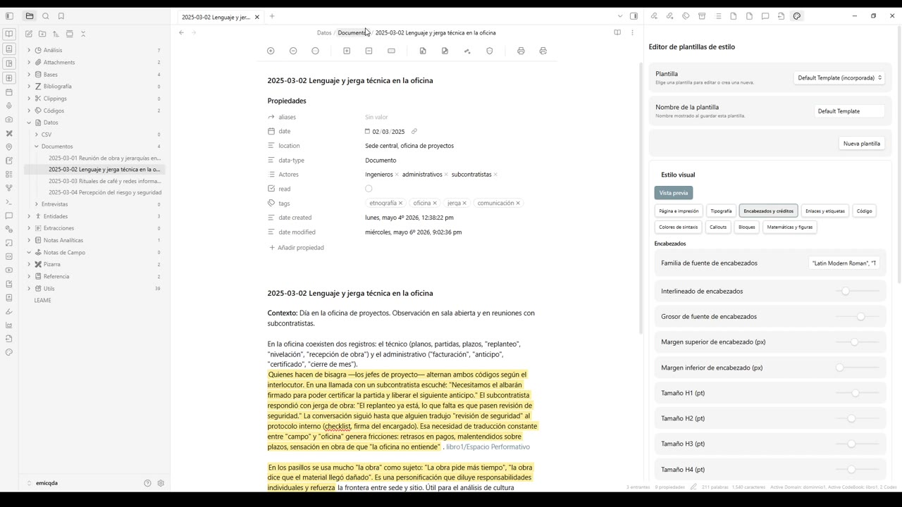
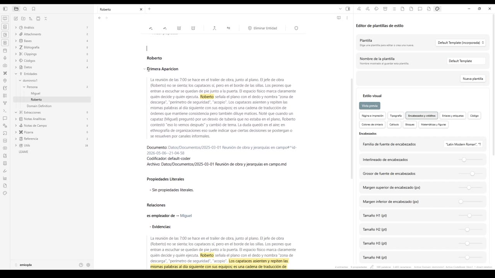
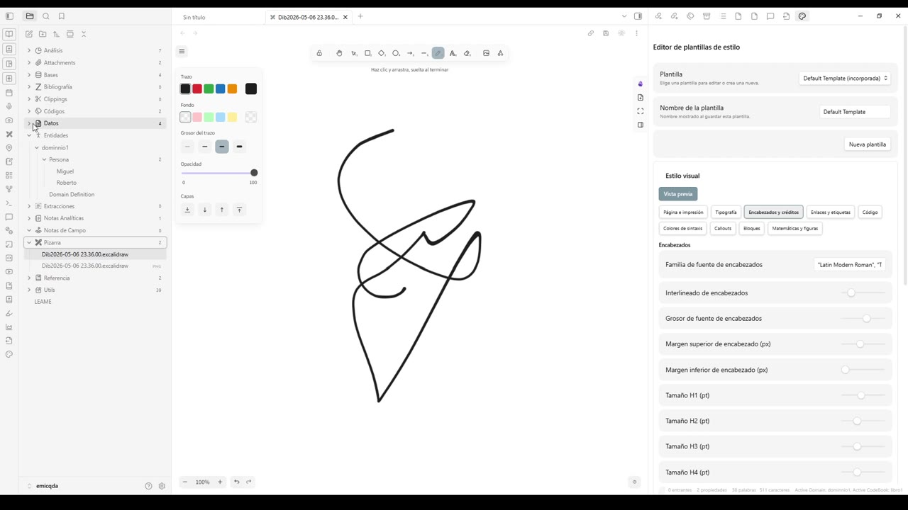
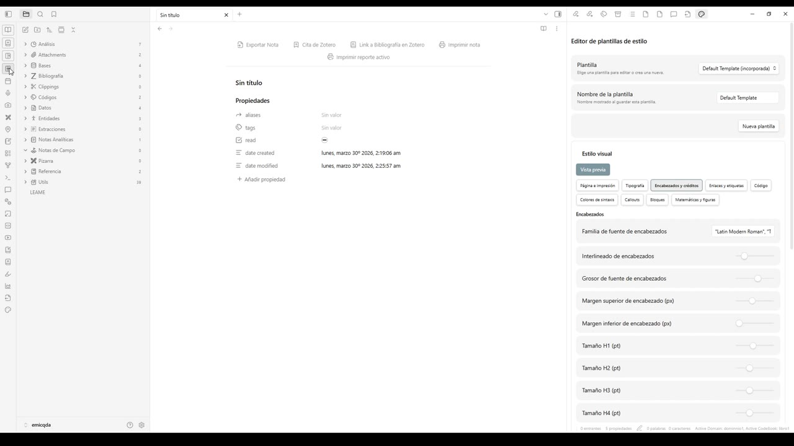

# 01 — Interfase de usuario

> Recorrido detallado por la interfaz de **EMIC Plus QDA**: cómo está organizada la barra lateral izquierda, qué contiene cada sección, qué muestra el panel central según el tipo de archivo y qué herramientas ofrece el panel derecho.

## Disposición general

La pantalla se organiza siempre en tres columnas:

- **Izquierda — barra lateral**: árbol de archivos del proyecto agrupados por sección (Análisis, Attachments, Bases, Bibliografía, Clippings, Códigos, Datos, Entidades, Extracciones, Notas Analíticas, Notas de Campo, Pizarra, Referencia, Utils).
- **Centro — panel principal**: muestra el archivo abierto. El contenido cambia según el tipo de archivo (un documento, una entidad, un código, una pizarra, un mapa, etc.).
- **Derecha — paneles auxiliares**: pestañas y herramientas que dependen del archivo activo. El video se concentra, sobre todo, en el **Editor de plantillas de estilo**, que se mantiene abierto a la derecha como referencia.

El editor de plantillas permite controlar la presentación impresa o exportable del proyecto: encabezados, tipografía, página e impresión, enlaces y etiquetas, código, colores de sintaxis, *callouts*, bloques, matemáticas y figuras. La sección *Encabezados* expone, por ejemplo, la familia tipográfica (`"Latin Modern Roman"`), el interlineado, el grosor de fuente, los márgenes superior e inferior y los tamaños de H1 a H4.

## Análisis

La sección *Análisis* concentra los flujos de procesamiento textual sobre el corpus.

Bajo *Análisis* aparecen las subcarpetas:

- *Análisis de Contexto*
- *Análisis de Emociones*
- *Análisis de Ontología*
- *Análisis de Sentimiento*
- *Análisis de Tópicos*, con dos archivos de configuración: `SeedWordsLDA` (palabras semilla para LDA) y `StopWords` (lista de palabras vacías).
- *Reportes*: salidas generadas por los análisis.
- `progress` (un archivo JSON que registra el avance de los procesos).

Cada subcarpeta agrupa los resultados que producen las rutinas correspondientes; los parámetros de cada algoritmo se editan desde los archivos auxiliares.

## Attachments (anexos)

*Attachments* es donde viven los archivos no textuales del proyecto.

Se subdivide en:

- *Bibliografía*: PDFs y documentos académicos vinculados con la sección de bibliografía.
- *Medios*: imágenes, audio y video del trabajo de campo.
- *Referencia*: imágenes institucionales o materiales de soporte (por ejemplo, los logos `EIDAES-…webp` y `EMIC-…webp` que aparecen al pie del árbol).

## Bases

*Bases* aloja conjuntos de datos tabulares o estructurados que sirven como base de soporte del análisis (por ejemplo, listas de actores, registros administrativos, glosarios).

## Bibliografía

*Bibliografía* es la entrada principal a las referencias académicas. Desde aquí se gestionan citas, vínculos a Zotero y notas de lectura.

## Clippings

*Clippings* recopila fragmentos cortos —recortes de prensa, capturas web, citas— que se importan al proyecto para alimentarlo con material complementario.

## Códigos

*Códigos* contiene los **libros de códigos**. Cada libro (en este proyecto, `libro1`) tiene una **definición** (`Codebook Definition`) y los códigos propiamente dichos (por ejemplo, `Espacio Performativo`).

La nota de un código muestra:

- Sus **propiedades**: identificador interno (`code-id`), nombre visible (`code display name`), conteo de relaciones (`relations-summary-json`), conteo de objetivos (`targets-summary-json`), fecha de actualización (`updated-at`) y descripción libre (`code description`, en este caso *"Efecto del espacio"*).
- Un bloque con el **identificador único del código** y la cantidad de relaciones que tiene.
- La sección **Referencias de párrafos asignados**: todos los pasajes del corpus que fueron etiquetados con ese código, con un enlace de retorno al documento de origen.

Esta vista actúa como "ficha viva" del código: cualquier cambio en los documentos se refleja automáticamente en la lista de evidencias.

### Menú del libro de códigos

Sobre la ficha del código aparece una barra de íconos. El último abre el menú dedicado al **libro de códigos** activo.

Las opciones de este menú son:

- *Cambiar libro de códigos activo* y *Crear definición del libro de códigos*: cambian o crean libros completos.
- *Crear múltiples códigos* y *Eliminar libro de códigos*: operaciones de alta y baja masivas.
- *Crear / Editar / Eliminar tipo de relación de código*: definen vínculos tipados entre códigos (por ejemplo, jerarquías o equivalencias).
- *Mostrar resumen de códigos*: vista agregada con conteos.
- *Coocurrencias de Códigos*: matriz de coincidencias entre códigos en los pasajes asignados.
- *Exportar definición del libro de códigos (JSON/CSV)* y *Exportar códigos del libro de códigos (CSV)*: salidas para reutilizar la estructura fuera del entorno.
- *Regenerar códigos*: reconstruye los archivos del libro a partir del estado actual.
- *Imprimir*: salida impresa del libro.

## Datos

*Datos* es la sección donde residen los documentos primarios y las fuentes estructuradas.

La carpeta se subdivide en:

- *CSV*: tablas que se importan o se generan dentro del proyecto.
- *Documentos*: notas de campo, observaciones, registros con fecha. Cada documento tiene una franja superior de propiedades (`aliases`, `date`, `location`, `data-type`, `Actores`, `read`, `tags`, `date created`, `date modified`) y, debajo, el cuerpo libre con los códigos resaltados.
- *Entrevistas*: transcripciones largas con un esquema propio.
- *Entidades*: links rápidos hacia las fichas de entidades vinculadas.

La línea superior del panel central muestra la **ruta del documento** (`Datos / Documentos / 2025-03-02 Lenguaje y jerga técnica en la oficina`), lo que ayuda a ubicarse en el árbol al saltar entre archivos.

## Entidades

*Entidades* organiza el grafo del proyecto: dominios, tipos y entidades concretas.

En el árbol se ve el dominio `dominio1`, con el tipo *Persona* y dos entidades, *Miguel* y *Roberto*, además del archivo `Domain Definition` que describe el dominio. Al abrir una entidad, la ficha muestra:

- **Primera Aparición**: el pasaje donde la entidad se nombra por primera vez, con marcas de los códigos asociados y los enlaces al documento original (`Documento`, `Codificador`, `Archivo`).
- **Propiedades Literales**: atributos directos de la entidad (en este caso, *"Sin propiedades literales"*).
- **Relaciones**: vínculos tipados con otras entidades. Para cada relación se enumeran las **Evidencias**: los pasajes del corpus que justifican el vínculo, con su contexto y enlaces de retorno.

La entidad se comporta como una "vista materializada": el sistema reúne automáticamente, en una sola página, todas las apariciones y relaciones registradas en los documentos.

## Extracciones

*Extracciones* es el contenedor de salidas derivadas del análisis: fragmentos extraídos automáticamente, tablas de coocurrencias, listas filtradas, resúmenes generados por las rutinas. Aparece vacío en el video porque el proyecto demo todavía no tiene extracciones consolidadas.

## Notas Analíticas

*Notas Analíticas* contiene las notas de interpretación del investigador: hipótesis, memos, conexiones entre códigos. Son el equivalente a los *memos* clásicos de la teoría fundamentada y se crean como cualquier otra nota Markdown del proyecto.

## Notas de Campo

*Notas de Campo* alberga los registros de campo crudos. La diferencia con *Datos / Documentos* es de propósito: aquí entran los apuntes rápidos, antes de que pasen por la depuración o el formato más estable de un *documento* fechado.

## Pizarra

*Pizarra* integra una superficie de dibujo libre (basada en Excalidraw) para esquemas, diagramas y bocetos.

Cada archivo de pizarra (`.excalidraw`) se abre con su propio panel lateral de herramientas: trazos, formas, flechas, paleta de colores, fondo, grosor del trazo, opacidad y capas. La pizarra se usa para el momento más informal del análisis: mapear relaciones, esbozar una estructura conceptual, marcar pendientes.

## Referencia

*Referencia* aloja los archivos institucionales o de contexto del proyecto. En el ejemplo, contiene dos notas: `EIDAES` y `EMIC`. Estas notas suelen incluir el logotipo y la descripción de las entidades responsables.

Esta captura muestra una **nota vacía** abierta dentro del proyecto. La barra superior reúne las acciones de salida disponibles para cualquier nota: *Exportar Nota*, *Cita de Zotero*, *Link a Bibliografía en Zotero*, *Imprimir nota* y *Imprimir reporte activo*. Es la misma barra que aparecerá luego en cualquier nota que se cree dentro de cualquier sección.

## Utils

*Utils* concentra archivos auxiliares del proyecto: plantillas, fragmentos de configuración y scripts. En el demo aparece con 39 archivos. No es una sección que se manipule a diario, pero suele guardarse cerca para mantener todo el ecosistema en el mismo *vault*.

## Cierre del recorrido

El video deja, sobre la mesa, un mapa mental claro del entorno: cada sección de la barra lateral cumple un rol específico (datos crudos, datos estructurados, conceptos, evidencias, salidas, configuración) y todas las vistas comparten la misma lógica de tres paneles. Una vez interiorizada esa lógica, el resto del manual puede entrarse a fondo en cada herramienta sin perder el sentido del conjunto.
