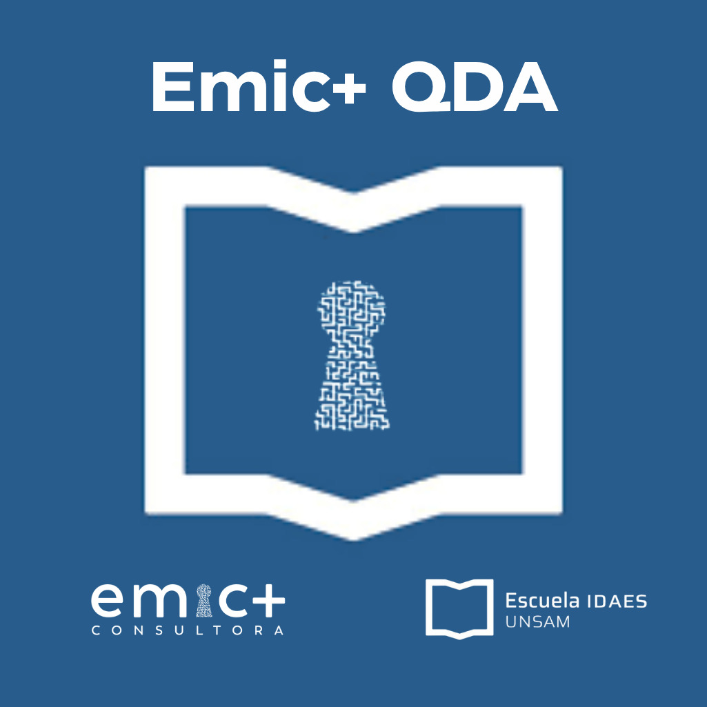
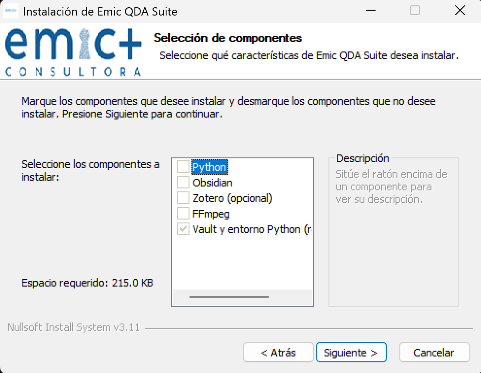
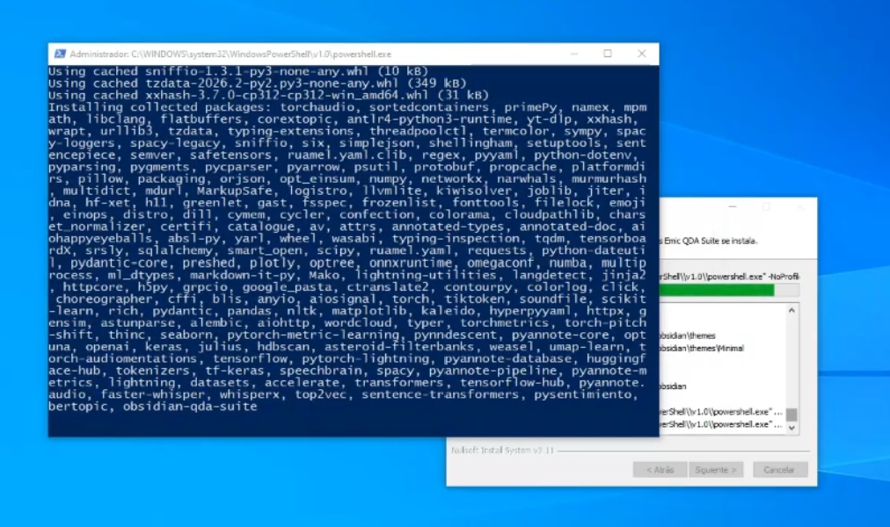

# Emic+ QDA

Guía de instalación de **Emic+ QDA** en **Windows** (instalador NSIS) y **macOS** (ZIP con la app y el DMG). **Los instaladores y paquetes listos para usar se descargan solo desde la sección [Releases](https://github.com/kalliopeargentina/Emic-QDA-suite/releases) del repositorio en GitHub** (apartado *Releases*, no el código fuente). La última release publicada es [**v0.5.8**](https://github.com/kalliopeargentina/Emic-QDA-suite/releases/tag/v0.5.8). **Emic+ QDA** es desarrollado por **Emic+ Consultora** y **EIDAES** (Escuela IDAES, Universidad Nacional de San Martín).

<p align="center">
  
</p>

## Tabla de contenidos

- [¿Qué es Emic+ QDA?](#qué-es-emic-qda)
  - [¿Qué habilita?](#qué-habilita)
  - [Herramientas desarrolladas para Emic+ QDA](#herramientas-desarrolladas-para-emic-qda)
  - [¿Para quién es?](#para-quién-es)
  - [Repositorios del ecosistema Emic+ QDA](#repositorios-del-ecosistema-emic-qda)
  - [Plugins de Obsidian incluidos en la plantilla](#plugins-de-obsidian-incluidos-en-la-plantilla)
  - [Plugins desarrollados por Emic](#plugins-desarrollados-por-emic)
  - [Otros plugins](#otros-plugins)
- [Instalación en Windows (instalador NSIS)](#instalación-en-windows-instalador-nsis)
  - [Requisitos del sistema](#requisitos-del-sistema)
  - [Cómo obtener el instalador](#cómo-obtener-el-instalador)
  - [Pasos para instalar](#pasos-para-instalar)
  - [Qué se instala](#qué-se-instala)
  - [Posibles problemas](#posibles-problemas)
  - [Desinstalación](#desinstalación)
- [Instalación en macOS](#instalación-en-macos)
  - [Qué incluye la release](#qué-incluye-la-release)
  - [Requisitos](#requisitos)
  - [Pasos](#pasos)
  - [Desinstalación (macOS)](#desinstalación-macos)
- [Sobre Emic+ Consultora y EIDAES](#sobre-emic-consultora-y-eidaes)

---

## ¿Qué es Emic+ QDA?

**Emic+ QDA** es un conjunto de herramientas para **análisis cualitativo de datos (QDA)** y **ciencias sociales computacionales**, pensado para que **no hace falta programar** para usarlo.

En **Windows**, el instalador NSIS deja en un solo entorno **Obsidian**, un **vault de plantilla**, **Python** (y paquetes de Emic+ QDA) y, opcionalmente, **Zotero** y **FFmpeg**. En **macOS**, el contenido del ZIP de la release (app + DMG) ejecuta un flujo equivalente usando **Homebrew** para esos componentes. Todo queda orientado a trabajar en una misma bóveda.

### ¿Qué habilita?

El conjunto de extensiones y herramientas incluidas permite:

- **Análisis cualitativo en Markdown:** codificar datos (entrevistas, textos, artículos), definir códigos, hacer extracciones por dimensiones y consultar todo desde la misma bóveda.
- **Análisis de coocurrencias:** ver relaciones entre códigos y entre dimensiones de extracción; explorar redes entre datos y códigos en vistas de grafo.
- **Gestión de propiedades y dimensiones:** ver, buscar y renombrar propiedades (dimensiones de extracción) en toda la bóveda; editar propiedades en lote en varias notas.
- **Referencias y literatura:** integrar citas, bibliografías y notas desde un gestor de referencias; mantener fichas y notas de literatura en la bóveda.
- **Medios (audio y video):** reproducir y anotar audio y video con marcas de tiempo, transcripciones y capturas; extraer y manipular fragmentos (con apoyo de herramientas externas de medios).
- **Visualización:** mapas interactivos (incl. geolocalización de notas), líneas de tiempo y gráficos de datos a partir del contenido de la bóveda.
- **Uso de IA en la bóveda:** consultar el contenido del vault, generar texto/tablas/listas y resumir notas o selecciones (según configuración del usuario).
- **Automatización:** plantillas con variables y lógica para crear notas, tablas de coocurrencias y análisis de extracciones; comandos de sistema ejecutables desde la bóveda con atajos.
- **Importación y exportación:** traer documentos Word, JSON/CSV (p. ej. encuestas o bases) y contenido web; exportar notas a Word.
- **Organización y mantenimiento:** copias de seguridad versionadas de los archivos, formateo y estilo de notas, comparación entre archivos y conversión/gestión de imágenes.

### Herramientas desarrolladas para Emic+ QDA

Además, Emic+ QDA incluye **herramientas propias** (paquetes Python) que amplían el análisis:

- **Análisis ontológico:** creación de **redes semánticas y grafos** a partir de los documentos y los datos de la bóveda.
- **Análisis de tópicos:** extracción de tópicos sobre el contenido de la bóveda (p. ej. LDA, BERTopic y otros métodos), integrable con el flujo de trabajo desde la interfaz de notas.
- **Análisis de sentimientos:** detección y clasificación de polaridad sentimental en textos.
- **Análisis de emociones:** identificación de dimensiones emocionales en el material cualitativo.
- **Análisis de contextos:** procesamiento y etiquetado de contextos discursivos o situacionales en los datos.

### ¿Para quién es?

Para quienes hacen **investigación cualitativa** o **ciencias sociales** y quieren una alternativa abierta, en Markdown, que permita codificar, extraer, analizar coocurrencias y acercarse a técnicas computacionales sin programar. **Emic+ QDA** es una iniciativa de **Emic+ Consultora** y **EIDAES** ([emic-consultora.com.ar](https://emic-consultora.com.ar)).

### Repositorios del ecosistema Emic+ QDA

- https://github.com/kalliopeargentina/Emic-Charts-View
- https://github.com/kalliopeargentina/Emic-Camera
- https://github.com/kalliopeargentina/Emic-Table-Tools
- https://github.com/kalliopeargentina/Emic-Reports
- https://github.com/kalliopeargentina/Emic-pdf-plus
- https://github.com/kalliopeargentina/ObsidianQDA-Suite
- https://github.com/kalliopeargentina/emic-qda
- https://github.com/kalliopeargentina/OntologyExplorer
- https://github.com/kalliopeargentina/OntologyMiner
- https://github.com/kalliopeargentina/obsidian-shellcommands

### Plugins de Obsidian incluidos en la plantilla

La bóveda de ejemplo trae una selección de complementos ya configurados para el flujo de trabajo cualitativo: unos son **desarrollados por Emic** para Emic+ QDA; el resto son **plugins de la comunidad** de Obsidian que suman mapas, literatura, plantillas, medios y más.

#### Plugins desarrollados por Emic

| Plugin | Para qué sirve | Proyecto |
|--------|----------------|----------|
| **Emic-QDA** | Codificar datos, definir códigos, extracciones y análisis cualitativo en Markdown. | [Ver en GitHub](https://github.com/kalliopeargentina/emic-qda) |
| **EMIC PDF++** | Trabajar con PDFs dentro del flujo QDA (lectura, anotaciones y vínculo con la bóveda). | [Ver en GitHub](https://github.com/kalliopeargentina/Emic-pdf-plus) |
| **Emic Report Architect** | Armar informes con varias notas y exportar a PDF o Word. | [Ver en GitHub](https://github.com/kalliopeargentina/Emic-Reports) |
| **Emic Charts View** | Gráficos a partir de los datos de la bóveda. | [Ver en GitHub](https://github.com/kalliopeargentina/Emic-Charts-View) |
| **Emic Table Tools** | Trabajar con tablas: exportar, referencias entre notas y utilidades de formato. | [Ver en GitHub](https://github.com/kalliopeargentina/Emic-Table-Tools) |
| **Emic-Camera** | Capturar fotos o video desde Obsidian para el material de campo. | [Ver en GitHub](https://github.com/kalliopeargentina/Emic-Camera) |

#### Otros plugins

Complementos de la comunidad de Obsidian que la plantilla incluye para mapas, tiempo, literatura, IA, plantillas y tareas comunes (orden alfabético):

- **Attachment Management** — Organizar y renombrar adjuntos.
- **Charts View** — Gráficos estándar de Obsidian (complemento distinto de **Emic Charts View**).
- **Chronos Timeline** — Líneas de tiempo en Markdown.
- **Commander** — Atajos y macros en la interfaz.
- **Copilot** — Asistente de IA con contexto de tu bóveda.
- **Custom File Viewer** — Abrir archivos con programas externos.
- **Docxer** — Importar y previsualizar documentos Word.
- **Dynamic Highlights** — Resaltados según reglas o selección.
- **Excalidraw** — Dibujos y diagramas.
- **Extended Markdown Syntax** — Más opciones de formato en Markdown.
- **File Explorer Note Count** — Ver cuántas notas hay por carpeta.
- **Iconize** — Iconos en carpetas y archivos.
- **Image Converter** — Convertir y optimizar imágenes.
- **Linter** — Revisar formato y estilo del texto.
- **Maps** — Mapas en las vistas tipo Bases.
- **Map View** — Mapas a partir de notas con ubicación.
- **Media Extended** — Audio y video con marcas de tiempo y notas.
- **Multi Properties** — Editar propiedades en muchas notas a la vez.
- **Note Toolbar** — Barras de herramientas por nota o carpeta.
- **Quadro** — Apoyo a codificación y extracciones en tablero.
- **Shell commands** — Comandos del sistema y atajos ([versión usada en Emic+ QDA](https://github.com/kalliopeargentina/obsidian-shellcommands)).
- **Templater** — Plantillas con variables y lógica.
- **Zotero Integration** — Citas, bibliografía y notas enlazadas con Zotero.

---

## Instalación en Windows (instalador NSIS)

### Requisitos del sistema

- **Sistema operativo:** Windows 10 o Windows 11 (64 bits).
- **Permisos:** Cuenta de usuario con permisos para instalar software (el instalador puede solicitar elevación UAC para instalar Python, Obsidian o Zotero).
- **Espacio en disco:** Al menos 1–2 GB libres (según los componentes que elijas).
- **Conexión a internet:** Necesaria para descargar Python, Obsidian y Zotero si el instalador los instala por ti.

### Cómo obtener el instalador

1. Entrá a [Releases](https://github.com/kalliopeargentina/Emic-QDA-suite/releases) del repositorio [Emic-QDA-suite](https://github.com/kalliopeargentina/Emic-QDA-suite). La release más reciente es [**v0.5.8**](https://github.com/kalliopeargentina/Emic-QDA-suite/releases/tag/v0.5.8); abrila o elegí otra versión en la lista si necesitás una anterior.
2. En esa página, bajá el **`.exe`** del instalador Windows desde el bloque **Assets** (archivos adjuntos de la release), por ejemplo:  
   `Emic-QDA-Installer-<versión>-<build>.exe`  
   (el nombre exacto figura en *Assets* de cada release).
3. Guardá el archivo en una carpeta de tu elección (por ejemplo, Escritorio o Descargas) y seguí con [Pasos para instalar](#pasos-para-instalar).

> **Nota:** el instalador no se obtiene con el botón verde *Code* → *Download ZIP*; eso baja el código del repo, no el programa empaquetado. Los `.exe` oficiales están solo en **Releases** → **Assets**.

### Pasos para instalar
[](https://www.youtube.com/watch?v=bkMSSwoIzos)
#### 1. Ejecutar el instalador

- Hacé **doble clic** en `Emic-QDA-Installer-....exe`.
- Si Windows SmartScreen muestra una advertencia (“Windows protegió su PC”):
  - Elegí **“Más información”** y luego **“Ejecutar de todas formas”**  
    (el instalador puede no estar firmado; si tenés una versión firmada, esta advertencia puede no aparecer).
- Si Windows solicita permisos de administrador (UAC), aceptá para permitir la instalación de componentes como Python u Obsidian.

#### 2. Pantalla de bienvenida

- Leé la bienvenida y hacé clic en **“Siguiente”**.

#### 3. Selección de componentes

Elegí qué querés que el instalador instale o configure:

| Componente | Descripción |
|------------|-------------|
| **Python** | Python 3.12 (necesario para las herramientas de línea de comandos de Emic+ QDA). Si ya tenés Python 3.12 o superior instalado, podés desmarcarlo. |
| **Obsidian** | Editor de notas para el vault de análisis cualitativo. Si ya tenés Obsidian instalado, podés desmarcarlo. |
| **Zotero** | Gestor de referencias. Opcional; desmarcalo si ya lo tenés o no lo usás. |
| **Repositorio (vault) Emic+ QDA** | Crea la carpeta del proyecto con la plantilla de Emic+ QDA (notas, configuración, etc.). Recomendado dejarlo marcado. |
| **FFmpeg** | Incluido solo si esta build del instalador lo trae; útil para medios. Podés desmarcarlo si no lo necesitás. |



Hacé clic en **“Siguiente”** cuando termines.

#### 4. Carpeta de instalación

- El instalador sugiere por defecto: **Documentos\Emic-QDA**.
- Podés cambiar la ruta si querés otra ubicación.
- Todos los componentes de Emic+ QDA (vault, entorno virtual de Python, etc.) se instalarán dentro de esta carpeta.

Hacé clic en **“Siguiente”**.

#### 5. Nombre del repositorio (vault)

- Indicá el **nombre** con el que querés que se cree la carpeta del vault dentro de la carpeta de instalación (por ejemplo: `Mi-Proyecto-QDA`).
- Si ya existe un vault con ese nombre en la misma ruta, el instalador puede preguntar si deseas sobrescribirlo; elegí según corresponda.

Hacé clic en **“Siguiente”**.

#### 6. Instalación

- El instalador descargará e instalará los componentes marcados (Python, Obsidian, Zotero, etc.) y configurará el vault y los paquetes Python. La instalación se hace con **instaladores oficiales** de cada aplicación.
- Seguí los pasos de cada instalador que se abra; si no querés cambios específicos, **aceptá los valores por defecto**.
- **No marques** la opción “Abrir la aplicación al terminar” (o similar) al final de cada instalador; cerrando cada uno, el instalador de Emic+ QDA continuará con el siguiente componente.
- Podés seguir el progreso en la ventana de detalles del instalador de Emic+ QDA.
- En algún momento de la instalación se abre una ventana emergente que puede quedar instalando sin cambios durante un largo rato, esta instalando todas las librerías de python. Es normal que tarde varios minutos.



- No cierres el instalador principal hasta que termine.

#### 7. Finalización

- Al finalizar, podés marcar la opción para **abrir el nuevo repositorio de Emic+ QDA** en Obsidian al cerrar el asistente. Si es la **primera vez** que usás Obsidian, se abrirá el administrador de vaults: ahí elegí **“Abrir carpeta como repositorio”** y seleccioná la carpeta del repositorio que el instalador acaba de crear. Solo hay que hacer esto la primera vez; después el repositorio ya queda agregado a Obsidian.
- Hacé clic en **“Finalizar”**.

### Qué se instala

- **Carpeta base:** La que elegiste (por defecto `Documentos\Emic-QDA`).
- **Vault:** Una subcarpeta con el nombre que indicaste, con la plantilla de Emic+ QDA (archivos de Obsidian, notas, etc.).
- **Entorno virtual de Python:** Dentro de la carpeta del vault o de la instalación; ahí se instalan los paquetes `ontology_explorer` (opcional, según build) y `obsidian_qda_suite`.
- **Python / Obsidian / Zotero:** Solo si los seleccionaste y el instalador los descargó e instaló (Python suele instalarse en el sistema vía instalador oficial; Obsidian y Zotero en sus ubicaciones habituales).

### Posibles problemas

- **SmartScreen o antivirus:** Si el .exe no está firmado, Windows puede advertir. Usá “Más información” → “Ejecutar de todas formas” si confiás en el origen del instalador.
- **UAC:** Si no aceptás la elevación, la instalación de Python/Obsidian/Zotero puede fallar. Ejecutá de nuevo el instalador y aceptá cuando pida permisos.
- **Python ya instalado:** Si tenés otra versión de Python (por ejemplo 3.11), el instalador puede instalar 3.12 en paralelo; podés desmarcar “Python” si preferís usar solo tu instalación y cumplir vos mismo los requisitos de Emic+ QDA.
- **Log de instalación:** En caso de error, el instalador puede generar un archivo de log en `%TEMP%` (por ejemplo `EmicQDA-install-<build>.log`). Ese archivo ayuda a diagnosticar fallos.

### Desinstalación

- La **carpeta de instalación** (p. ej. `Documentos\Emic-QDA`) y su contenido (vault, entorno virtual) **no se borran** de forma automática; podés eliminarla a mano si querés quitar todo.
- **Python, Obsidian y Zotero** instalados por el instalador hay que desinstalarlos por separado desde “Agregar o quitar programas” si deseas eliminarlos.

---

## Instalación en macOS

### Qué incluye la release

Como en Windows, los archivos para macOS se bajan desde la sección [**Releases**](https://github.com/kalliopeargentina/Emic-QDA-suite/releases) (pestaña *Releases* del repo, no *Code*). En la release [**v0.5.8**](https://github.com/kalliopeargentina/Emic-QDA-suite/releases/tag/v0.5.8) (la última publicada) verás en **Assets** el **ZIP** de macOS y el **DMG**; nombres de ejemplo: `macOS-v0.5.8.zip`, `Emic-QDA-Installer-macOS-0.5.8-2026-05-03.dmg` (pueden variar según la release).

El artefacto principal es un **archivo ZIP** (p. ej. `macOS-v0.5.8.zip`). Al descomprimirlo encontrás, entre otros:

- **`Emic QDA Installer.app`** — aplicación del instalador (misma lógica que el script `install.sh` empaquetado en los recursos de la app).
- Un **`.dmg`** con el mismo instalador en formato disco (p. ej. `Emic-QDA-Installer-macOS-0.5.8-2026-05-03.dmg`): podés montarlo y copiar la app a **Aplicaciones** o ejecutarla desde el volumen.

Los `.dmg` y `.zip` grandes **no** se versionan en Git (límite de tamaño de GitHub); solo se publican como adjuntos de release.

### Requisitos

- **macOS** compatible con Obsidian y [Homebrew](https://brew.sh).
- **Homebrew** — el instalador usa `brew` para Python 3.12 (`python@3.12`), Obsidian y Zotero (`--cask`), y FFmpeg (`ffmpeg`), en línea con `installer/macos/install.sh`.
- **Permisos** para instalar software y ejecutar la terminal cuando el script lo requiera.
- **Internet** para las descargas de Homebrew y los casks.
- **Espacio en disco:** al menos 1–2 GB libres.

Si aún no tenés Homebrew:

```bash
/bin/bash -c "$(curl -fsSL https://raw.githubusercontent.com/Homebrew/install/HEAD/install.sh)"
```

Seguí las instrucciones que imprime el instalador de Homebrew para añadir `brew` al PATH (en Apple Silicon suele ser necesario evaluar el bloque que muestra al final).

### Pasos

1. En [Releases](https://github.com/kalliopeargentina/Emic-QDA-suite/releases), abrí la [release v0.5.8](https://github.com/kalliopeargentina/Emic-QDA-suite/releases/tag/v0.5.8) (o la más reciente) y descargá el **ZIP** de macOS y, si lo necesitás, el **`.dmg`**, desde **Assets**.
2. Descomprimí el ZIP y ubicá **`Emic QDA Installer.app`** y el **`.dmg`**.
3. **Opción A — Solo la app:** abrí `Emic QDA Installer.app` desde la carpeta descomprimida, o mové la app a **Aplicaciones** y ejecutala desde ahí.
4. **Opción B — DMG:** abrí el `.dmg`, arrastrá la app a **Aplicaciones** (o ejecutá la app desde la ventana del disco montado).
5. Si macOS muestra que no puede verificar el desarrollador, abrí **Ajustes del sistema → Privacidad y seguridad** y permití la ejecución, o usá **clic derecho → Abrir** la primera vez.
6. En el asistente: aceptá términos si aparecen, elegí carpeta de instalación, nombre del vault y qué instalar (Python, Obsidian, Zotero, FFmpeg). El script instala la plantilla del vault, crea el entorno virtual y ejecuta `pip` para **`obsidian_qda_suite`** (y Ontology Explorer solo si la build lo habilitó).
7. Al terminar, abrí **Obsidian** y usá **Abrir carpeta como bóveda** apuntando al vault creado (ruta que indique el instalador).

La **versión** y el **build** de Emic+ QDA en macOS coinciden con los de Windows (definidos en `installer/macos/install.sh` y `installer/config.nsi`, p. ej. `0.5.8` / `2026-05-03`).

### Desinstalación (macOS)

- Borrá la carpeta donde instalaste el vault y el entorno virtual si ya no los necesitás.
- Componentes instalados con Homebrew podés quitarlos con `brew uninstall` / `brew uninstall --cask` según corresponda.

---

## Sobre Emic+ Consultora y EIDAES

<p align="center">
  
</p>

**Emic+ QDA** es desarrollado por **Emic+ Consultora** y **EIDAES** (Escuela IDAES, Universidad Nacional de San Martín). **Emic+ Consultora** se consolidó como referente en investigación social aplicada —territorios, mercados, opinión pública y comportamiento— con raíces en la universidad pública. **EIDAES** aporta el marco académico y la colaboración en la mejora continua del producto.

En **Emic+ Consultora** nos guía una ética que prioriza el compromiso, la integridad en las relaciones humanas y la confidencialidad de la información. Nuestro objetivo es traducir la complejidad social y la saturación de datos en análisis claros y accionables concretos, sin perder rigor ni sensibilidad por los contextos donde ocurren los fenómenos que estudiamos.

De esa vocación, del conocimiento en ciencia de datos y de la experiencia en más de treinta proyectos de investigación aplicada, surge **Emic+ QDA**: herramientas integradas para la investigación cualitativa. Ante los altos costos y la cautividad de datos de muchos programas comerciales, desarrollamos esta solución gratuita, de código abierto y **100% local** para proteger información sensible, reuniendo en un solo entorno registro en distintos formatos, codificación, análisis avanzado, visualización e IA. Junto a investigadores de **EIDAES**, seguimos mejorando funciones y experiencia de usuario.

Con el vínculo entre investigación aplicada y desarrollo tecnológico, buscamos demostrar que las ciencias sociales también pueden diseñar instrumentos profesionales y aportar de forma colaborativa a la comunidad científica.

Más información: [emic-consultora.com.ar](https://emic-consultora.com.ar)

---
